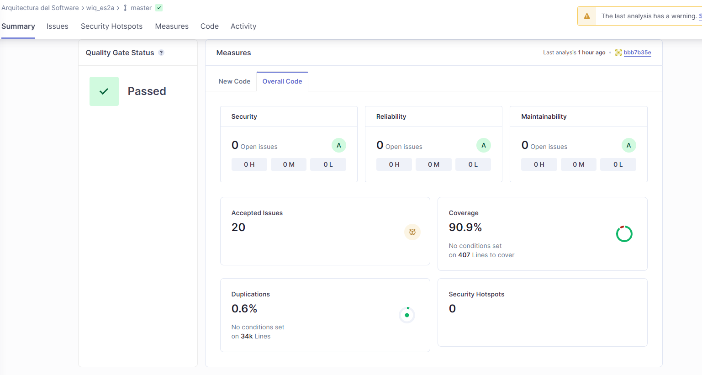

ifndef::imagesdir[:imagesdir: ../images]

[[section-glossary]]
== Pruebas realizadas
A continuación se recogen los diferentes tipos de pruebas realizados para garantizar el correcto funcionamiento de la aplicación y cumplir con el límite de coverage del 80% que se requería para el proyecto.

=== Pruebas Unitarias
Se han realizado un total de 43 pruebas unitarias repartidas entre los servicios y componentes de la aplicación. Se ha utilizado la librería Jest para realizar estas pruebas, además de otras más especializadas dependiendo del test como la librería de testing de React para los componentes o Axios para simular las llamadas a los endpoints.

Con estos test se ha conseguido cubrir un 90'9% del código presente en la aplicación, proporcionando una alta fiabilidad del correcto funcionamiento de la misma.
A continuación se muestra el resumen proporcionado por SonarCloud sobre la calidad de nuestro código:

[sonar-cloud]

=== Pruebas E2E (End to End)
Se han realizado 5 pruebas E2E a las funciones más importantes de la aplicación: Login, register, Game y Record. Estas pruebas se han reallizado utilizando las librerías de Pupeteer y Jest-Cucumber, las cuales nos permiten probar su funcionalidad utilizando Chromium.

